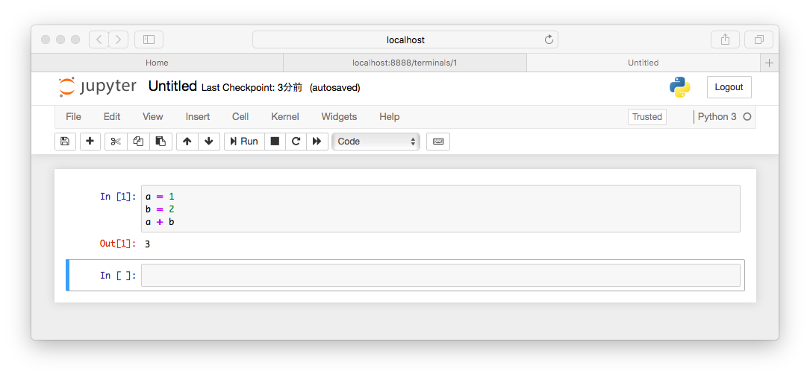

# Python入門
## 環境構築
### macOS
- Homebrew

  https://brew.sh/index_ja

- Python
```sh
brew install python
```

- 動作確認
```sh
python3
```

### Windows
- 公式サイトからダウンロードしてインストール
- https://www.python.org/

## パッケージ管理ツール
### 使い方
```sh
pip3 install xxx
```
### パッケージ一覧
- 手動で作成
```sh
echo 'パッケージ' >> requirements.txt
```

- 全パッケージ情報を含んだ一覧の作成
```sh
pip freeze > constraints.txt
```

- パッケージ一覧による一括インストール
```sh
pip3 install -r requirements.txt -c constarints.txt 
```

## 仮想環境
```sh
# 作成
mkdir basis
python3 -m venv basis

# 有効化
source basis/bin/activate

# 無効化
deactivate
```

## 対話モード
- 「python」とタイプしてEnter

### 電卓としての利用
```sh
>>> 1 + 2 * 4
9
>>> 5 / 10 + 1
1
```

### 変数の代入
```sh
>>> a = 18 + 4
>>> b = 3 - 1
>>> a + b
24
```

### 関数電卓としての利用
- mathという標準ライブラリをimportする
```sh
>>> import math
>>> math.sin(1) # 三角関数
0.8414709848078965
>>> math.pi # 円周率
3.141592653589793
```

### IPython
- 高機能RPEL (Read-Eval-Print-Loop = 対話型実行環境)
#### インストール方法
```sh
pip install ipython
```
#### 起動方法
```sh
$ ipython

...(省略)...

In [1]:
```
- In[X]:(Xは数字)のあとに新しい入力を開始する。

#### よく使われる機能
##### イントロスペクション
- オブジェクトの調査機能
```sh
In [1]: a = 2                                                   In [2]: a? # オブジェクトのあとに?をつける
Type:        int
String form: 2
Docstring:  
int([x]) -> integer
int(x, base=10) -> integer
```

- ??をつけるとより詳細な情報を確認できる場合もある。

##### シェルシステムへのアクセス
```sh
In [1]: !echo "Hello World!"                                    Hello World!
```

##### マジックコマンド
- %または%%から始まる特殊コマンド
###### %quickref
- マジックコマンドのクイック・リファレンス
###### %debug
- デバッガの起動
###### %env
- システム環境変数の取得
###### %history
- コマンドの実行履歴の表示
###### %load
- Pythonのソースコードの読み込み
###### %logstart、%logstop
- ログの取得
###### %macro
- マクロの定義
###### %pdoc
- docstring(後述)の表示
###### %reset
- IPythonのリセット
###### %timeit
- 実行時間の計測
###### %xdel
- 変数の削除

### Jupyter Notebook
- ブラウザ上でIPythonによる対話的なシェル環境を提供するWebアプリケーション
- インストール
```sh
pip install jupyter
```
- 起動
```sh
jupyter notebook
```


## 基本的な書き方
### 文の書き方
- 改行が文(statement)の区切り。
- 複数行に渡って文を記述する場合は、行末に\(バックスラッシュ)を記述。
- ()、[]、{}の途中で改行となる場合はバックスラッシュを省略可能。

### コメント
#### 1行コメント
```py
x = 1 # xの定義
y = 2 # yの定義

# zの定義
z = x + y
```
- 行の始めのほかに、コードの後ろに記述することもできる。

#### 複数行コメント
- """でかこむ
- docstringと呼ばれる文字列定義を利用した記述方式。
- モジュール、関数、クラスを定義するときに、仕様内容をこの形式で記述する。
- APIドキュメントにも利用される。
```py
def test_func(a, b)
  """test_func
  This is test func.

  :param a: numerical object
  :param b: numerical object
  :return: sum of a and b
  """
  return a + b
```

### データ型
#### 主なデータ型
##### int
- 整数値型
##### float
- 倍精度浮動小数点数
##### bool
- 真偽値型。TrueとFalseのいずれかの値を取る。
##### str
- 文字列型
##### list
- リスト型。ミュータブルな順番付きオブジェクト集合。
##### tuple
- タプル型。イミュータブルなオブジェクト集合。
##### set
- ミュータブルな順序のないオブジェクト集合。
##### dict
- 辞書型。順序のないkey-value型のオブジェクト集合。
##### bytes
- 8ビットの要素を持つイミュータブルなバイト配列型
##### bytearray
- ミュータブルなバイト配列型

#### 補足
- リスト型、タプル型、辞書型のオブジェクトはコンテナオブジェクトという。ほかのデータ型のオブジェクトの集合で構成される。

#### データ型の確認
- type()を使う
```sh
>>> a = 1
>>> type(a)
<class 'int'>

>>> b = 'test'
>>> type(b)
<class 'str'>
```
- intとstrの演算はできない
```sh
>>> a + b
Traceback (most recent call last):
  File "<stdin>", line 1, in <module>
TypeError: unsupported operand type(s) for +: 'int' and 'str'
```
- 変数aを文字列型に変換すると文字列結合になる。
```sh
>>> str(a) + b
'1test'
>>> 
```

#### ミュータブルなオブジェクト、イミュータブルなオブジェクト
##### イミュータブルなオブジェクト
- 定義したあとに、そのオブジェクトの要素を変更できない型
```sh
>>> a = (1,3)
>>> a[0] = 1
Traceback (most recent call last):
  File "<stdin>", line 1, in <module>
TypeError: 'tuple' object does not support item assignment
```
- tupleはイミュータブルなので、一度定義した変数の要素を変更しようとするとエラーになる。

##### ミュータブルなオブジェクト
- 定義したあとに、そのオブジェクトの要素を変更できる型
```sh
>>> b = [1,2,3,4]
>>> b[2] = 5
>>> b
[1, 2, 5, 4]
```
- listはミュータブルなので、一度定義した変数の要素を書き換えられる。

### 制御フロー
#### if文 - 条件分岐
```sh
>>> utc_time = 12
>>> city = 'tokyo'
>>> if city == 'london':
...     print('{}時です'.format(utc_time))
... elif city == 'tokyo':
...     print('{}時です'.format(utc_time + 9))
... else:
...     print('都市名を選んでください')
... 
21時です
```
- if文の括弧はなし
- インデントでブロックを表現、判別。

#### for文、while文 - ループ
- 処理のブロックはインデントで判別。

##### リストを用いたfor文
```sh
>>> for name in ['太郎', '次郎', '花子']:
...     print('こんにちは、{}'.format(name))
... 
こんにちは、太郎
こんにちは、次郎
こんにちは、花子
```

##### rangeを用いたfor文
- 特定回数ループする場合に便利。
- 始点、終点、増分を与えることで指定した組み合わせのリストを生成。
- 始点と増分は省略可能。省略した場合は0から指定した数値-1までの値を持つシーケンスを生成。
```sh
>>> for i in range(3):
...     print('りんごが{}個'.format(i))
... 
りんごが0個
りんごが1個
りんごが2個
```

##### enumerateを用いたfor文
- インデックス付きのループ処理を行える。

```sh
>>> for i, name in enumerate(
...             ['太郎','次郎','花子']):
...     print('{}, {}'.format(i, name))
... 
0, 太郎
1, 次郎
2, 花子
```

##### while文
```sh
>>> i = 0
>>> while i < 3:
...     print('{}は3より小さい'.format(i))
...     i += 1
... 
0は3より小さい
1は3より小さい
2は3より小さい
```

#### with文 - システムリソースを安全に使うための書き方
withブロックを抜ける際にあらかじめ定義された終了処理が呼び出される。
```sh
>>> with open('test.txt') as f:
...     print(f.read())
... 
1行目
2行目
3行目

```
これは以下と等価
```sh
>>> f = open('test.txt')
>>> print(f.read())
1行目
2行目
3行目

>>> f.close()
```
- with文はある処理の開始時と終了時の処理をカプセル化して安全かつ簡潔な処理を記述できる。
- 例では、f.close()が終了時の処理。with文を使用した場合は、with文の中の処理が全て完了したあと自動的にファイルを閉じる処理が行われる。

#### リスト内包表記 - リスト生成の効率化
- 簡潔かつ効率的にリスト生成を行う方法
##### for文を使用した2の倍数リストの生成
```sh
>>> a = []
>>> for x in range(10):
...     a.append(x * 2)
... 
>>> print(a)
[0, 2, 4, 6, 8, 10, 12, 14, 16, 18]
```
##### リスト内包表記による2の倍数のリストの生成
```sh
>>> [x * 2 for x in range(10)]
[0, 2, 4, 6, 8, 10, 12, 14, 16, 18]
```
- リストの要素を先頭に記述し、その後ろに反復シーケンスを表記する。
- if文を使用することも可能
```sh
>>> [x * 2 for x in range(10) if x % 2 == 0]
[0, 4, 8, 12, 16]
```

### 関数
- defを使う。
```sh
>>> def func():
...     print('function')
... 
>>> # 関数の呼び出し
... func()
function
```

- 関数はオブジェクト。変数に代入できる。
```sh
# 引数として関数を渡す
>>> type(func)
<class 'function'>

# 関数funcを変数fに代入 
>>> f = func

# func()と同じ意味
>>> f()
function 
```
#### 関数チェックリスト
- defで関数定義を始めているか。
- 関数の名前はアルファベット、数字、_（アンダースコア）で構成されているか。ただし、数字から始まるのはNG。
- 関数名の直後に左丸括弧を記述したか。
- 左丸括弧に続いてパラメータをカンマ区切りで記述したか。
- パラメータの名前を一意にしたか。
- パラメータの最後を右丸括弧で閉じてコロンを記述したか。
- 関数に結びつけるすべてのコードを４つのスペースでインデントしたか。
- インデントのない行（dedent）で関数を終了したか。

#### 関数を作る
##### シンプルな関数定義
```sh
>>> def add_one(n):
...     return n + 1
... 

# キーワード引数を使った関数の呼び出し
>>> add_one(n=1)
2

# 位置引数を使った関数の呼び出し
>>> add_one(1)
2
```
- 関数名がadd_one
- 引数を１つとる
- キーワード引数＝引数名を指定して渡した引数
- 位置引数＝引数名を指定せずに渡した引数

##### デフォルト引数の利用
```sh
# 引数c, dのデフォルト値は0
>>> def add(a, b, c=0, d=0):
...     print('a:{}, b:{}, c:{}, d:{}'.format(a,b,c,d))
...     return a + b + c + d
... 

# c, dはデフォルト値が使われる
>>> add(1,2)
a:1, b:2, c:0, d:0
3

# 対応する位置の引数に渡される
>>> add(1,2,3,4)
a:1, b:2, c:3, d:4
10

# キーワード引数を使うと位置にとらわれない
# cはデフォルト値が使われる
>>> add(1,2,d=3)
a:1, b:2, c:0, d:3
6

# キーワード引数を使った呼び出しは
# 位置引数より後ろにする必要がある
>>> add(a=1,2)
  File "<stdin>", line 1
SyntaxError: positional argument follows keyword argument
>>> 
```
- デフォルト値をもつ引数は、デフォルト値を持たない引数より後ろで定義する必要がある。
- デフォルト値とキーワード引数を組み合わせることで簡潔かつ柔軟な関数呼び出しが可能。
- 関数のオーバーロード機能はない。

##### 可変長引数
###### 可変長引数を受け取る関数の定義
- 引数に*を付けると、任意の数の引数を受け取る可変長引数を利用できる。
- 渡された引数はタプルに格納される。
- 引数名には慣例として*argsが使われることが多い。
```sh
>>> def add(*args):
...     r = 0
...     for i in args:
...         r += i
...     return r
... 
>>> add(1)
1
>>> add(1,2,3)
6
```

###### 位置引数と可変長引数
- 可変長引数は位置引数の最後に置く。
- 可変長引数の最後に置くことができる引数はキーワード専用引数のみ。
```sh
# 可変長引数の前にはゼロ個以上の位置引数を置ける
>>> def mul(a, b, *args):
...     v = a * b
...     for i in args:
...         v *= i
...     return v
... 
>>> mul(1, 2, 3, 4)
24

# 可変長引数の後ろにはキーワード専用引数のみ置ける
>>> def mul(a, b, *args, x=2):
...     v = a * b
...     for i in args:
...         v *= i
...     return v * x
... 
>>> mul(1, 2, 3, 4)
48

# キーワドを指定して渡す。xの値は5。
>>> mul(1, 2, 3, 4, x=5)
120
```

##### キーワード引数で可変長引数  
- キーワード引数も任意の数の引数を受け取ることができる。
- キーワード引数で可変長引数を扱う場合は、慣例として引数名に **kwargs がよく使われる。
```sh
# 任意の数のキーワード引数を受け取る関数
>>> def multi_args(*args, **kwargs):
...     print(args)
...     print(kwargs)
... 
>>> multi_args(1, 2, a=3, b=4)
(1, 2)
{'a': 3, 'b': 4}
```

#### 引数リストのアンパック
- 関数呼び出し時に*演算子でリストやタプルから引数を展開する機能。
- **演算子を使うと辞書のアンパックが行われ、キーワード引数に渡される。
```sh
>>> x = [1, 2, 3]
>>> y = {'a':4, 'b':5}

# multi_args(1, 2, 3, a=4, b=5)の呼び出しと等価
>>> multi_args(*x, **y)
(1, 2, 3)
{'a': 4, 'b': 5}

# アンパックは可変長引数でなくても使える
>>> def sub(a, b):
...     return a - b
... 
>>> z = {'a':6, 'b':7}
>>> sub(**z)
-1
```

### クラス
#### クラスの定義方法
```sh
>>> class Vehicle:
...     def __init__(self, model):
...         self.model = model
...         self.meter = 0
...     def move(self):
...         self.meter += 1
...         print(self.meter)
... 
```
- インスタンスメソッド __init__()、move()を定義
- インスタンスメソッドの第1引数はインスタンス自身なので、慣例としてselfを指定
- __init__()はシステムが呼び出すメソッド。インスタンスの初期化に利用
- インスタンス変数は、インスタンスに属性を追加すると作成できる。

#### クラスのインスタンス化
```sh
# インスタンス化
>>> vehicle = Vehicle(2017)

# インスタンス変数にはドット記法でアクセス
>>> vehicle.model
2017

# インスタンスメソッドの呼び出し
>>> vehicle.move()
1
>>> 
```

#### クラスの継承
```sh
>>> class Vehicle:
...     def __init__(self, model):
...         self.model = model
...         self.meter = 0
...     def move(self):
...         self.meter += 1
...         print(self.meter)
... 
>>> class HornMixin:
...     def blow(self):
...         print('Beep!')
... 
# オーバーライドしたメソッド内で
# スーパークラスのメソッドを呼び出す
>>> class Car(Vehicle, HornMixin):
...     def move(self):
...         self.meter += 1
...         super().move()
... 
>>> car = Car(2016)
>>> car.model
2016
>>> car.move()
2
>>> car.blow()
Beep!
```
- スーパークラスはクラス名のあとに()で指定する。
- スーパークラスをカンマ区切りで指定すると多重継承できる

```sh
>>> Car.mro()
[<class '__main__.Car'>, <class '__main__.Vehicle'>, <class '__main__.HornMixin'>, <class 'object'>]
```
- 多重継承では、複数のスーパークラスで同じ名前のメソッドが定義されていることがある。
- どちらのクラスのメソッドが先にみつかるかはmro()で確認する。

#### クラスオブジェクトとインスタンス
##### クラス変数、クラスメソッドの定義方法
```sh
>>> class RacingCar(Car):
...     speed = 2 # クラス変数
...     @classmethod
...     def inspect(cls, cars=None): # クラスメソッド
...         cars = cars or []
...         for car in list(cars):
...             print('Model:{}, Meter:{}, Speed:{}'.format(car.model, car.meter, car.speed))
...     def move(self):
...         self.meter += self.speed
...         super().move()
... 
>>> car1 = RacingCar(2010)

# 比較のために少し進める
>>> car1.move()
4
>>> car2 = RacingCar(2017)

# クラスメソッドを呼び出す
>>> RacingCar.inspect([car1, car2])
Model:2010, Meter:4, Speed:2
Model:2017, Meter:0, Speed:2

# クラス変数の更新はクラスオブジェクトを通して行う
>>> RacingCar.Speed = 3

# クラス変数は共有されている
>>> RacingCar.inspect([car1, car2])
Model:2010, Meter:4, Speed:2
Model:2017, Meter:0, Speed:2

# インスタンス変数を通して値を代入すると、新たにインスタンス変数が定義される。
>>> car2.speed = 4
>>> RacingCar.inspect([car1, car2])
# このSpeedはクラス変数RacingCar.speed
Model:2010, Meter:4, Speed:2

# このSpeedはインスタンス変数car2.speed
Model:2017, Meter:0, Speed:4
```

### 名前空間とスコープ
- 名前空間やスコープはディレクトリのようなもの。
- すべてのファイルを１つのディレクトリにまとめるとファイルが探しづらくなり、管理が複雑になる。
- ディレクトリを分けるとグループごとに整理できるように、名前空間とスコープを使うことで冗長なコードやバグの混入を避けられる。
- クラスを作ることも名前空間を分ける方法の１つ。

#### 名前空間
- 名前からオブジェクトへの対応づけ
##### 例
- A.func、B.func
- ドットでアクセスできる要素＝属性
- funcのみの場合、直接アクセス可能な領域にfuncオブジェクトが定義されていなければNameErrorとなる。
- 直接アクセスできる領域＝スコープ
##### スコープ
#### 例
- 関数ないで定義する変数＝ローカル変数
- スコープは関数内

### モジュールの作成
- モジュールファイルを作成
```py
def add(a, b):
    return a + b

def mul(a, b):
    return a * b
```
- モジュールのimport
```sh
>>> import calc
>>> calc.add(1,2)
3
>>> calc.mul(1,2)
2
```
- fromを使うと、モジュール内の特定の属性のみをimportできる。
```sh
>>> from calc import add
>>> add(1,2)
3
```

#### モジュールをスクリプトファイルとして実行する
- モジュールファイルに追記する。
```py
def add(a, b):
    return a + b

def mul(a, b):
    return a * b

# ファイルの末尾に追記
if __name__ == '__main__':
    print(add(1,2), mul(1,2))
```
- シェルで実行
```sh
(basis) $ python calc.py 
3 2
```
- pythoコマンドに渡されたモジュールは、 __name__の値が__main__の状態で実行されるため、スクリプトとして実行したいモジュールは if __name__ == '__main__': ブロックを書くことが慣例となっている。
- モジュールがimport文で読み込まれた場合は、__name__ はモジュール名(この場合はcalc)となり、ブロック内では実行されない。

### パッケージの作成
- 関連するモジュールをディレクトリに集めてパッケージにすることができる。
- モジュールを階層的に管理する機能
- __init__.py という名前のファイルのあるディレクトリをパッケージとみなす。
- __init__.py の中身は空でもOK。
```sh
my_package/
├── __init__.py
└── calc.py
```

#### パッケージのimport方法
- モジュールのimportと同じ。
```sh
>>> import my_package.calc
>>> my_package.calc.add(1,2)
3
>>> from my_package import calc
>>> calc.add(1,2)
3
>>> from my_package.calc import add
>>> add(1,2)
3

# 別名でimportする機能
# 名前の衝突を避けたいとき、簡潔な名前でアクセスしたいときに利用
>>> from my_package.calc import add as my_add
>>> my_add(1,2)
3
```
