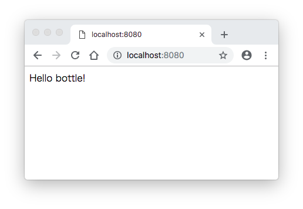
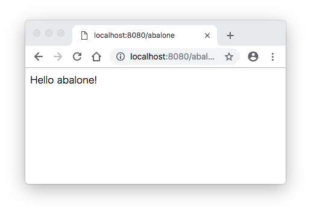

# Pythonで作るWebアプリケーション
## 有名なフレームワーク
### Django
- フルスタックな定番フレームワーク
- ルーティング、テンプレートエンジン、O/Rマッパー、国際化機構を含む
- データベースのデータ管理画面を標準搭載
### Bottle
- 本体のコードは1ファイル
- マイクロフレームワーク
- 外部パッケージは不要
- ルーティング、テンプレートエンジン、開発用WEBサーバーを含む
### Flask
- 「ボトルじゃなくてフラスコ」。エイプリルフールのジョークとして生まれた。
- マイクロフレームワーク
- Flask Extensions。拡張機能で多くのライブラリが登録されている。
### Tornado
- 非同期処理が得意
- ノンブロッキングネットワークI/Oをベースとした非同期処理が特徴

## Bottleを使ったWEBアプリケーション開発
- Pythonの実行環境があれば手軽に利用できる
- プロトタイプ開発や小規模案件で利用されている。
### Bottleのインストール
- 公式サイトからbottle.pyファイルをダウンロードして実行ディレクトリに配置するだけで利用できる。
- 実際の開発では、ほかのライブラリと同様にpipコマンドでインストールすることが多い。
```sh
# 仮想環境の作成
$ python3 -m venv webapp
$ source webapp/bin/activate

# Bottleのインストール
(webapp) $ pip install bottle
(webapp) $ bottle.py --version
Bottle 0.12.13
```
### Bottleの基本的な使い方
- 以下の内容でapp.pyを作成する。
```py
from bottle import debug
debug(True)

from bottle import route, run

@route('/')
def index():
    return 'Hello bottle!'

@route('/abalone')
def result():
    return 'Hello abalone!'

# reloaderにTrueをセットするとファイル更新で再起動する
run(host='localhost', port=8080, reloader=True)
```
- app.pyの起動
```sh
python app.py
```
- ブラウザでhttp://localhost:8080/にアクセス

- ブラウザでhttp://localhost:8080/abaloneにアクセス


#### ルーティング
- アクセス先URLよWebアプリケーションの処理を対応付ける機能
- アクセス先URLを引数としたデコレータ@routeで呼び出したい関数をデコレート
- @routeはキーワード引数methodでHTTPメソッド(GET、POST、PUT、DELETEのいずれか）の指定もできる。
```py
# /abaloneのHTTPメソッドをPOSTに変更
@route('/abalone', method='POST')
def result():
    return 'Hello abalone!'
```

#### テンプレートエンジン
##### SimpleTemplate機能
- レスポンスにテンプレートファイルを利用できる。
- rebaseキーワードを使う
- %で始まる行をコードとして実行できる
- {{ var }}と書くことで変数varの値を表示させることができる。
- {{ !var }}と書くとエスケープ処理を無効化できる。

#### リクエストオブジェクト／レスポンスオブジェクト
- クライアントからのリクエスト情報はrequestオブジェクトに格納される。
- リクエスト情報：アクセス先URL、HTTPメソッド、リクエストボディ、ヘッダ、Cookieなど
